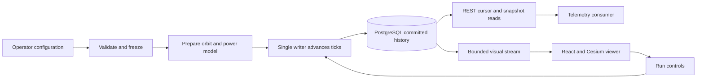

# Understand the Implemented Simulator

The implementation follows the causal path defined in the [specification](specification.md): validated configuration, deterministic orbit and environment, electrical-power state, durable public telemetry, and a browser viewer.
The viewer consumes backend outputs and does not calculate orbital physics.

## See the System at a Glance

A **run** is one execution of a validated configuration. A **tick** is one elapsed simulated second in that run; wall time only controls how quickly ticks are committed. This separation lets a paused or slower run produce the same physical measurements.



The writer commits measurements before either reader can see them. The REST cursor is for durable replay; the visual stream is for a responsive display and can ask the viewer to resynchronize. The [API guide](api.md) shows how to read each one.

## Find the Code

```text
backend/src/metis_sim/
  domain/         # Validated configuration and public data shapes
  models/         # Orbit, coordinate frames, eclipse, operations, power
  application/    # Run preparation, measurement mapping, single writer
  adapters/       # Safe configuration parsing and PostgreSQL storage
  api/            # FastAPI routes, authentication, WebSocket, static UI
  cli.py          # metis-sim init, migrate, serve, demo
frontend/src/
  api/            # Browser session, visual stream, generated API types
  scene/          # Cesium scene and committed-time playback
  panels/         # Selected spacecraft telemetry
configs/          # Demo and matched healthy configuration
schemas/          # Generated JSON Schema; do not edit by hand
tests/            # Physics, contracts, and integration checks
```

For example, start in `models/power.py` to understand a battery calculation, then read `application/measurement.py` to see which results become public channels. Start in `frontend/src/scene/playback.ts` to understand how a committed sample reaches the viewer.

## Follow the Service Boundary

`backend/src/metis_sim/domain` contains immutable configuration, public contracts, channel catalogues, and physics-facing types.
`backend/src/metis_sim/models` implements fixed-step J2 propagation, frames, illumination, eclipse, power allocation, and the configured scenario.
`backend/src/metis_sim/application` composes prepared engines, durable commands, and the single writer runner.
`backend/src/metis_sim/adapters` owns configuration parsing, PostgreSQL persistence, cursor reads, and writer ownership.
`backend/src/metis_sim/api` composes FastAPI routes, role authentication, scoped viewer sessions, WebSocket presentation, and static frontend serving.

The contract source is Python Pydantic models.
`scripts/generate_contracts.py` generates JSON Schema and the frontend TypeScript API types from those models.
Do not hand-edit generated files.

## Follow One Measurement

1. The configuration adapter parses YAML or JSON into the immutable `SimulationConfig` contract.
1. `SimulationService` prepares `SimulationEngine`, which computes the bounded physical run from the same epoch and fixed tick sequence.
1. The runner samples each tick. `MeasurementProjector` maps physical state to allowlisted public frames and separate private truth.
1. The repository commits the batch and its run status in PostgreSQL. Readers only see committed ticks.
1. A consumer paginates public frames with a durable cursor. The viewer gets a current snapshot and bounded visual updates; it never reconstructs eclipse or battery physics itself.

The private scenario may affect generated power, but its settings, seed, and outcome labels do not appear in public frames. See the [contract rules](contracts.md) for exact fields and replay semantics.

## Keep the Boundaries Small

| Decision | Why it exists | Simpler extension path |
|---|---|---|
| One application process and one writer | A single committed clock avoids conflicting ticks and partial publication. | Add new model behavior within the existing runner and repository boundary. |
| Pure physical model modules | Orbit and power calculations can be checked without HTTP or database setup. | Put new equations in `models/` and connect them through the engine. |
| Generated public contracts | Python validation and TypeScript consumers use the same shapes. | Change the Pydantic source, regenerate artifacts, then check the diff. |
| Separate public and private projections | A viewer or telemetry consumer cannot receive evaluation answers. | Add public fields through explicit response models and projection tests. |
| PostgreSQL frame log and cursors | A consumer can recover after disconnecting without requiring a broker. | Read with stable stream identities and save the returned cursor after processing. |

To make a change, follow [the contributor guide](contributing.md) for focused checks, then use [validation evidence](validation/README.md) to see what the current model has actually demonstrated.

## Preserve Simulation and Persistence Semantics

Each run has an immutable resolved configuration, manifest, seed, and per-satellite public stream identity.
The runner is the only writer for a configured source identity and uses a PostgreSQL advisory lock.
It advances at fixed simulated one-second steps, commits frames and events durably, and pauses or fails on persistence pressure rather than silently dropping frames.

The public API exposes allowlisted telemetry, ordinary observed events, current snapshot data, and bounded orbit-only trajectories.
Private scenario details and evaluation truth use separate storage and require the evaluator role.
The exact envelope, cursor, idempotency, and privacy rules are in [Configuration and Data Contracts](contracts.md).

## Use the Viewer Safely

The compiled React/Cesium application is served from `frontend/dist` by the FastAPI process.
Browser controls use a restricted run-scoped session, CSRF token, and explicit origin allowlist.
Local `metis-sim demo` is intentionally loopback-only.

For a bridge-network container or other deployment, an authenticated operator must provision the viewer cookie through `POST /v1/operator/runs/{run_id}/viewer-session` after preparing the run.
A trusted operator-facing workflow forwards that cookie to the authorized browser.
The browser receives no operator bearer credential; it receives only the scoped HttpOnly session and its control CSRF token.
The deployment must allow the browser's exact origin and should set secure cookies when it is served over HTTPS.

The development Vite server proxies API and health requests to the local service.
The production container instead serves the precompiled frontend and API together.

## Build and Operate One Process

The [Dockerfile](../Dockerfile) uses pinned Python 3.12.12 and Node 22.23.0 image digests, installs uv 0.10.2, resolves the frozen Python lockfile, compiles the frontend, and runs as a non-root user.
The [application Compose overlay](../compose.app.yaml) joins the base PostgreSQL service from [compose.yaml](../compose.yaml), migrates before serving, reads ignored local secrets, exposes only localhost, and runs one Uvicorn worker.

Do not add multiprocess workers for this service.
Writer ownership is intentionally one process per source identity.

## Check the Evidence and Model Limits

[Physics Validation Evidence](validation/physics.md) records executed numerical checks for the idealized J2, Astropy Sun/eclipse, and bounded energy-store model.
Those checks support the synthetic model within the stated short-arc envelope.
They do not establish flight ephemeris accuracy, battery electrochemistry, solar-weather behavior, or a mission-grade operational simulator.

[Implementation Validation and Review](validation/README.md) links the separate contract, persistence, security, observability, numerical, browser, and capacity evidence.
The [browser report](validation/browser.md) records actual Cesium scene rendering, clock agreement, reconnect/staleness behavior, and local asset checks.
The specification remains the acceptance source; each report names its workload, measurement method, and limits.
