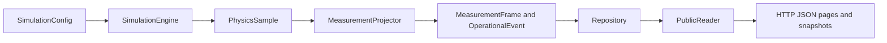

# Understand the Python Objects

The HTTP API is the supported boundary for an external telemetry consumer. Its JSON shapes come from Python Pydantic classes, but an external service does not need to import the simulator package. This page explains those classes so you can read a response, validate a fixture, or change the implementation without confusing public measurements with private model state.

Start with [the API consumer guide](api.md) if you want to fetch live data. The [generated public schema](../schemas/public-api.v1.schema.json) and [configuration and data contracts](contracts.md) are the exact field references. The object guide below explains the boundaries; the generated reference pages read the current Python source directly.

## Browse the Generated Reference

The reference renders class signatures, methods, typed attributes, source links, and
NumPy-style `Parameters`, `Returns`, `Raises`, and `Notes` sections directly from
Python docstrings on every documentation build. Internal type annotations link to
the corresponding documented objects.

- [Configuration and loading](reference/configuration.md)
- [Public telemetry and responses](reference/public-data.md)
- [Physics and simulation engine](reference/physics.md)
- [Application services](reference/application.md)
- [Persistence and cursor reads](reference/persistence.md)
- [HTTP and runtime](reference/runtime.md)

## Follow the Object Flow



`SimulationConfig` holds validated instructions. `PhysicsSample` is an internal result and includes private truth. `MeasurementProjector` creates the allowed public objects before storage and delivery. The browser and consumers see the right side of the diagram only.

## Read Configuration Objects

| Object | What it represents | Main contents |
|---|---|---|
| `SimulationConfig` | One complete, immutable input document | Run timing, profiles, satellites, constellations, private scenario |
| `RunConfiguration` | Time and model choices shared by all satellites | UTC epoch, duration, one-second tick, speed, seed, model IDs |
| `SpacecraftProfile` | Reusable power and sensor setup | Panel, battery, loads for each mode, public limits |
| `SatelliteDefinition` | One named spacecraft instance | Stable ID, profile reference, initial orbit, operations, visual marker |
| `OrbitConfiguration` | Initial orbit at the epoch | Classical elements with explicit metres and degrees |

These classes live in `backend/src/metis_sim/domain/config.py`. `load_configuration` in `adapters/configuration.py` is the safe YAML/JSON entry point; it rejects malformed or unsupported input before creating `SimulationConfig`.

After [installing Python dependencies](getting-started.md#install-the-prerequisites), inspect the shipped configuration:

```bash
uv run python - <<'PY'
from pathlib import Path

from metis_sim.adapters.configuration import load_configuration

config = load_configuration(Path("configs/demo.yaml").read_text())
print(config.run.duration_s)
print([satellite.satellite_id for satellite in config.satellites])
PY
```

This reads a local file only. It does not create a run or connect to PostgreSQL. The Pydantic configuration is frozen after validation; change the input document and validate it again rather than mutating a live run.

## Read Public Telemetry Objects

| Object | Where it appears | What to use it for |
|---|---|---|
| `ChannelReading` | Each `MeasurementFrame.channels` value | Read a typed value and its quality (`valid`, `missing`, `invalid`, or `saturated`). |
| `MeasurementFrame` | `/v1/telemetry`, snapshots, visual messages | Identify a sample by `source_id`, `stream_id`, and `sequence`; read its observation time, mode, sample window, and channels. |
| `OperationalEvent` | `/v1/events` | Read observed mode, public limit, and unserved-power transitions in a separate event sequence. |
| `PublicRunStatus` | Run status, snapshots, viewer messages | See lifecycle and the last committed tick, public spacecraft descriptors, speed, and model provenance. |
| `Snapshot` | `/v1/runs/{run_id}/snapshot` | Read one consistent committed status plus bounded recent frames. |
| `Trajectory` | `/v1/runs/{run_id}/trajectory` | Display backend orbit points in ITRS coordinates; it has no future health or power values. |
| `VisualMessage` | `/v1/runs/{run_id}/visual` WebSocket | Update a live viewer or resynchronize its bounded buffer. It is not a durable consumer cursor. |

`MeasurementFrame` and `OperationalEvent` are in `domain/telemetry.py`; the other response models are in `domain/public.py`. All public models reject extra fields, and timestamps require a UTC offset. A missing or invalid channel has a `null` value; check `quality` before using the number.

For example, code that receives one telemetry page can validate a frame with the same model used by the service:

```python
from metis_sim.domain.telemetry import MeasurementFrame

frame = MeasurementFrame.model_validate(page["items"][0])
identity = (frame.source_id, str(frame.stream_id), frame.sequence)
soc = frame.channels["eps.battery_soc"]
if soc.quality == "valid":
    print(identity, soc.value)
```

Here `page` is the JSON object returned by `GET /v1/telemetry`. An external consumer can validate against [telemetry.v1 JSON Schema](../schemas/telemetry.v1.schema.json) instead of importing Python. Save the page's `next_cursor` after processing; the frame identity makes replay safe to deduplicate. See the [consumer example](../examples/consumer.py).

## Understand Internal Services

These classes are for contributors working inside the Python application. They are not a separate client SDK.

| Object | Responsibility | Important method or boundary |
|---|---|---|
| `SimulationEngine` (`models/engine.py`) | Precompute deterministic orbit, environment, and battery states for a validated run. | `initialize()` prepares; `sample(tick)` reads stable satellite-ordered physical samples; `trajectory(...)` reads orbit-only points. |
| `PhysicsSample` (`domain/physics.py`) | Hold one physical endpoint and completed-interval power allocation, including private truth. | `public_channels()` is an explicit allowlist; do not serialize the full object. |
| `MeasurementProjector` (`application/measurement.py`) | Turn physical samples into public frames/events and separate private truth rows. | `project(samples)` returns the three distinct collections for one tick. |
| `SimulationService` (`application/service.py`) | Create immutable revisions and prepared runs; provide bounded orbit previews. | `create_configuration(...)`, `create_run(...)`, `trajectory(...)`. |
| `Runner` (`application/runner.py`) | Own the single writer thread, fixed ticks, wall pacing, and durable command acknowledgements. | `command(...)` applies a run control at a committed boundary. |
| `Repository` (`adapters/repository.py`) | Write run state, public frames, events, and private truth in transactions. | Used by service and runner; never an external consumer interface. |
| `Database` (`adapters/database.py`) | Own the SQLAlchemy connection and one producer's writer lock. | `acquire_writer()` excludes a second writer for the same source. |
| `PublicReader` (`adapters/reads.py`) | Read public streams, cursor pages, and consistent snapshots. | `streams()`, `page(...)`, `snapshot(...)`. |
| `Auth` (`api/auth.py`) | Verify role tokens and issue restricted viewer sessions. | API routes call `principal(...)` and enforce role/run scope. |
| `Settings` (`settings.py`) | Load deployment database, secret, origin, and path settings. | `Settings.from_env()`; these values do not belong in public run manifests. |
| `ServiceError` (`application/errors.py`) | Carry a safe code, message, status, and details across the service boundary. | The API converts it to the documented JSON error envelope. |

`create_app()` in `api/app.py` composes these objects into one FastAPI process. The [implementation guide](implementation.md) explains why there is one writer and how committed data reaches consumers.

### Call the Main Methods

| Method | Input | Result |
|---|---|---|
| `load_configuration(content, format="yaml")` | YAML or JSON text, at most 1 MiB | Immutable `SimulationConfig`; rejects unsafe or invalid input. |
| `SimulationEngine.initialize()` | A previously constructed engine | Prepared engine with fixed physical arrays; call once before sampling. |
| `SimulationEngine.sample(tick)` | Integer elapsed second from zero through the run duration | Tuple of `PhysicsSample` objects in stable satellite ID order; includes private truth. |
| `SimulationEngine.trajectory(satellite_id, from_tick, to_tick, step=10)` | One spacecraft and inclusive tick bounds | Tuple of orbit-only `OrbitSample` points, including the final endpoint. |
| `MeasurementProjector.project(samples)` | Physical samples for one tick | Public frames, public events, and private truth as three separate lists. |
| `PublicReader.page(stream_id, after, limit, kind="telemetry")` | Stream ID, prior cursor or `None`, page limit, and telemetry/events kind | Public page with `items`, `next_cursor`, `has_more`, retained bounds, and delivery mode. |
| `PublicReader.snapshot(run_id, at=None, history=1)` | Run ID, optional UTC time, and bounded history count | Consistent committed public status and frames. |
| `Runner.command(run_id, action, speed, token)` | Run control plus the idempotency token | Public status after durable acknowledgement, or a `ServiceError` if it cannot be applied. |

These methods live on different sides of the privacy boundary. For example, a contributor may inspect `SimulationEngine.sample(0)` while testing physics, but must pass that result through `MeasurementProjector` before any public response. An API consumer uses the [HTTP routes](api.md#find-an-endpoint), not these internal methods.

## Read NumPy-Style Docstrings

Public Python classes and functions use a short purpose statement followed by sections such as `Parameters`, `Returns`, `Raises`, `Attributes`, and `Notes` when relevant. For example, `SimulationEngine.sample(tick)` documents the tick input, stable satellite ordering, and the private-content boundary. Read a docstring in a Python shell with:

```bash
uv run python - <<'PY'
from metis_sim.models.engine import SimulationEngine

print(SimulationEngine.sample.__doc__)
PY
```

For exact HTTP request and response fields, use the [generated OpenAPI page](api.md#find-an-endpoint) and generated schemas rather than treating an internal method signature as a network contract.
