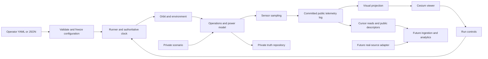

# Metis Satellite Simulation Specification

## 1. Decision and Reading Order

Build a **configurable, deterministic satellite operations simulator with an orbit-driven electrical power model and a synchronized Earth-orbit viewer**.
It is a replaceable source for Metis's future monitoring and analysis platform.
It generates measurements and controlled failure outcomes; the separate analytics product detects, forecasts, explains, and recommends.

Read this document first for scope and component ownership.
Then read [Physics Model](physics-model.md) for equations, fidelity, and numerical gates, and [Configuration and Data Contracts](contracts.md) for objects, YAML, telemetry, persistence, and API semantics.
Requirement identifiers in these documents are stable reference points for implementation work, not a prewritten backlog.

This is the normative design and acceptance baseline. The delivered implementation and measured results are reported separately in [implementation validation](validation/README.md); requirements here remain gates to verify, not automatic claims of completion.
Normative words **must**, **should**, and **may** mean required for the selected milestone, recommended, and optional respectively.
Where research notes disagree, these three specification documents take precedence.

## 2. Product Intent and Scope Boundary

Satellite operations specialists need to distinguish expected orbital behavior from developing hardware problems, assess the operational consequence, and decide what to do before a limit is crossed.
The wider Metis product can eventually combine telemetry ingestion, mode-aware baselines, forecasts with uncertainty, anomaly detection, evidence-linked explanations, operator alerts, and human-approved response plans.
Fleet comparisons should account for spacecraft configuration, orbital illumination, and operational mode rather than compare raw values indiscriminately.

The simulator supports that product by making the causal chain inspectable:

**Orbit and epoch → Sun and eclipse geometry → panel illumination → generated power and scheduled load → battery energy → observable telemetry → later analytics.**

It must be possible to remove the simulator and connect a real telemetry adapter without rewriting the downstream measurement contract.
Real hardware needs a mapping adapter and mission-specific calibration; interchangeability does not mean synthetic models transfer to real satellites without validation.

| User | Outcome needed from this service |
|---|---|
| Operations specialist | See where each configured satellite is at the displayed simulation time and inspect its current power state. |
| Simulation author | Add or vary satellites and scheduled scenarios through validated configuration without changing source code. |
| Analytics engineer | Consume repeatable, timestamped measurements without privileged fault schedules or labels. |
| Integration engineer | Reconnect, replay, identify duplicates, and replace the source without learning simulator internals. |
| Future model evaluator | Compare predictions with separately held ground truth, including runs with no failure. |

The service owns satellite configuration, the simulation clock, orbital/environment calculations, subsystem state, sensor measurements, reproducible scenario execution, durable output, and its visual viewer.
It does **not** own anomaly models, risk scores, estimated failure time, natural-language recommendations, notification delivery, a Grafana dashboard, or autonomous commands to real spacecraft.
The viewer may show measured state and explicitly configured limit violations; it must not fabricate an AI health score.

## 3. Priorities and Completion Boundary

This specification is prepared in advance for use during the hackathon.
No fixed implementation window or staffing commitment has been supplied; milestones below use completion gates rather than invented dates.
Preserve one complete end-to-end power scenario before adding subsystem breadth.

| ID | Priority | Required behavior and scope |
|---|---|---|
| CFG-01 | P0 | Validate YAML and equivalent JSON through one schema; create immutable configuration revisions and run manifests. |
| CFG-02 | P0 | Configure 1–10 satellites; ship a three-satellite demonstration using one spacecraft profile and distinct orbital phases. |
| RUN-01 | P0 | Create, start, pause, resume, change speed, and stop a run; reproduce a run from its manifest and seed. |
| PHY-01 | P0 | Compute backend positions, Earth orientation, Sun geometry, eclipse, panel incidence, solar power, load, and battery energy from simulation time. |
| EPS-01 | P0 | Include nominal, payload-active, and safe electrical loads; integrate bounded battery energy and expose a power balance. |
| FLT-01 | P0 | One configurable progressive solar-array derating scenario, one matched healthy control, and an explicit energy-limit failure criterion. |
| DATA-01 | P0 | Store immutable 1 Hz simulated-time frames, operational events, configuration provenance, and separate private truth. |
| DATA-02 | P0 | Expose cursor-based batch reads and replay for consumers; use a separate bounded WebSocket presentation stream for the viewer. |
| VIS-01 | P0 | Earth, orbiting satellites, simulation UTC, start/pause/speed, satellite selection, zoom, follow, orbit context, and timestamped power detail. |
| VAL-01 | P0 | Pass orbital, power, time, leakage, replay, isolation, and end-to-end acceptance gates; record hardware and measured throughput. |
| EXT-01 | P1 | Imported TLE/SGP4 orbit adapter, richer battery voltage/current model, calibrated thermal node, or another justified subsystem. |
| EXT-02 | P1 | Reliable outbound HTTP adapter, ground-station delivery windows, Parquet export, recorded-run UI seek, and optional GLB satellite assets. |
| EXT-03 | P2 | Basilisk-backed dynamics adapter, reaction-wheel degradation, multi-node thermal physics, large constellations, and persisted mid-run checkpoints. |

P0 does not include six complete subsystems, four different progressive faults, orbital maneuver planning, inter-satellite RF links, collision avoidance, orbit determination, a full spacecraft attitude dynamics solver, radiation, weather/space-weather forecasting, flight software emulation, or CCSDS packet emulation.
A constellation in P0 is a group of independently propagated satellites with a shared clock; membership alone does not create communications, formation control, or shared battery state.

An accelerated degradation episode is a synthetic scenario, not a claim that normal solar-array aging occurs over minutes.
The UI and exported manifest must identify synthetic runs.
“Predictive” describes the later analytics target, not an implemented capability of this service.

## 4. Main User Flows

### Configure and Start a Constellation

An author submits a profile, satellites, run settings, schedule, and optional private fault scenario.
The service returns all validation failures with field paths before any run starts.
A valid request creates an immutable resolved revision; starting a run allocates independent state per satellite.
The author can add another satellite by submitting a new configuration revision using supported model types.
An active run retains its original membership and configuration.

**Acceptance:** adding a fourth satellite changes configuration only, produces its own ordered stream, appears in the viewer, and leaves the other satellites' noiseless physics unchanged.

### Inspect the Same State Visually and Numerically

An operator opens a run, sees its UTC simulation time, selects a satellite, and reads generated power, requested and supplied load, battery energy/SOC, sunlight state, mode, and data freshness.
Selection preserves context during zoom and follow.
Every value identifies its sample time; the UI does not combine live health values with an unrelated scrubbed orbital position.

**Acceptance:** at a given time the globe position and backend state agree within the visualization gate, and eclipse-driven power changes are visible in the same time window.

### Feed the Later Analytics Service

A consumer reads the public channel catalog and resumes a stream from its last acknowledged cursor.
It persists its own input offset and handles duplicates idempotently.
It receives measurements, ordinary observed mode transitions, timestamps, and explicit source provenance.
Private scenario definitions, impending failure times, hidden derating factors, and evaluation labels are unavailable with that consumer's credentials.

**Acceptance:** interrupting and reconnecting a consumer yields every retained frame exactly once after consumer deduplication, with no privileged truth fields accessible.

### Reproduce a Developing Failure

The demonstration starts three satellites nominally; only one has the private derating schedule.
The affected satellite's measured generation falls for comparable illumination, energy recovery per orbit weakens, and a configured low-energy outcome eventually occurs.
An evaluator can replay or regenerate the run and compare a healthy control with the affected run.

**Acceptance:** the pre-failure interval contains measurable evidence, the outcome is determined by state rather than a hard-coded failure timestamp, and the healthy control does not hit that outcome within the same duration.
No particular ML detection score or warning lead time is an acceptance gate for the simulator.

## 5. Recommended Technology Stack

| Layer | Selection | Why / boundary |
|---|---|---|
| Backend | Python 3.12 baseline, FastAPI, Pydantic v2, Uvicorn | Typed API/configuration boundary around a Python simulation domain; one server worker for P0. |
| Physics/data arrays | NumPy float64, Astropy coordinates/time/Sun, pinned IERS data | Shared epoch/frames and array calculations; a small reviewed central+J2 force model, not a second framework scheduler. |
| Reference validation | SciPy high-accuracy integrator and analytic fixtures | Independent numerical checks; not a required production orchestration layer. |
| Persistence | PostgreSQL 17 baseline, Psycopg, SQLAlchemy, Alembic | One durable transactional store for identity, history, configuration, and separate truth. |
| Configuration | Safe YAML parsing → Pydantic → normalized JSON | Same validation path for files and a future configuration form. |
| Viewer | Flutter/Dart, CesiumJS through web interop | Earth/time/coordinate-aware rendering and camera controls; no browser orbital physics. |
| Integration | REST cursor reads + JSON; bounded WebSocket viewer stream | Durable consumer replay and smooth presentation serve different access patterns. |
| Local runtime | Docker Compose for backend/database; compiled UI served with API | Small reproducible deployment with a local-data/offline demo mode. |
| Verification | pytest, focused numerical/property tests, schema fixtures, Playwright | Check physics, contracts, persistence failures, and browser behavior. |

The language/database majors above are conservative baseline choices, not claims that they are the newest releases.
Implementation must resolve compatible library versions, commit Python and frontend lockfiles, pin container image versions/digests, and prove a clean install on the demo machine.
Do not install dependencies from floating branches or upgrade astronomical data mid-run.

FastAPI derives request validation and API schemas from typed models; Cesium supports sampled positions in defined reference frames. [FastAPI request bodies](https://fastapi.tiangolo.com/tutorial/body/), [Cesium position properties](https://cesium.com/learn/cesiumjs/ref-doc/SampledPositionProperty.html)
The [contracts appendix](contracts.md) specifies why plain PostgreSQL is the initial database and when another store becomes justified.

## 6. Architecture and Replacement Boundary

Use a modular application with one deployment boundary for P0.
The user-visible simulator service contains internal components, not a fleet of separately deployed microservices.
Apply single responsibility at the module level, dependency inversion at external I/O boundaries, and composition for spacecraft models.
Do not introduce a generic entity-component framework, dynamic plugins, event-sourcing framework, or broker merely to make the design “extensible.”



The future data handler normalizes real protocols to the same measurement contract and owns operational ingestion/history.
It does not require the simulator's database schema or control API.
Its Grafana connector, analytics jobs, or AI service use its own data layer.
During early integration a consumer may read the simulator's durable API directly; private simulator tables are never the integration contract.

Internal component interfaces should remain small:

| ID / component | Inputs | Outputs / owned responsibility | Depends on |
|---|---|---|---|
| MOD-01 Configuration | YAML/JSON and supported type catalog | Validated resolved revision, errors, canonical hash | Schema models only |
| MOD-02 Run coordinator | Frozen revision, commands, monotonic wall time | Lifecycle, simulation ticks, deterministic ordering | MOD-01, persistence port |
| MOD-03 Orbit/environment | Epoch, initial orbit, tick, pinned data | GCRS/ITRS state, Sun geometry, shadow, incidence | Time/array libraries; no DB or HTTP |
| MOD-04 Operations/EPS | Schedule, environment, prior energy, private modifier | Requested load, power allocation, energy, observable state | Domain contracts from MOD-03 |
| MOD-05 Scenario/evaluation | Private progression and physical state | Parameter modifier, private outcome/censoring | Runner time and domain state |
| MOD-06 Measurement | Public allowlist, domain state, sensor seed | Versioned frames/events with units and quality | Public schemas; no future truth values |
| MOD-07 Persistence/read | Immutable batch and cursor | Atomic append, replay, consistent snapshot | PostgreSQL adapter |
| MOD-08 API/control | Authenticated typed request | Run commands, public/private projections by role | Coordinator/read ports |
| MOD-09 Viewer | Public status, samples, trajectories | Interactive scene, selected state, freshness | Generated API types and Cesium |

The scenario's modifier affects EPS; the measurement mapper receives only its needed state projection, not the scenario object.
The evaluator can observe hidden state without influencing public measurements.
Every asynchronous boundary is explicit: command application, commit acknowledgement, and visual publication.
Do not block the HTTP event loop with long propagation/precomputation; use a dedicated runner thread or worker loop with bounded queues, still owned by one application process.

Implementation layout:

```text
backend/src/metis_sim/
  domain/          # profiles, state, model protocols, time/value contracts
  models/          # orbit, environment, operations, EPS, sensors, scenarios
  application/     # runner, command serialization, public projections
  adapters/        # PostgreSQL repositories, YAML loader, API transport
  api/             # FastAPI routes/auth and generated public schemas
frontend/lib/
  api/             # generated types and bounded stream client
  scene/           # Cesium adapter, camera, trajectory and time handling
  main.dart        # Flutter run control, satellite list, selected measurements
frontend/web/      # Cesium rendering bridge and local assets
configs/           # reviewed example configurations
tests/             # domain, contract, persistence, and end-to-end fixtures
```

Keep pure domain contracts independent of FastAPI/SQLAlchemy/Cesium classes.
Use one composition root to instantiate models from supported types and inject repository/clock ports.
New satellite instances reuse those types; they do not require new folders, routes, or database tables per satellite.

## 7. Operational and Nonfunctional Requirements

**NFR-01 — Throughput:** demonstrate three satellites at 20× and validate the advertised maximum of ten at 20×, 1 Hz simulated telemetry, for ten wall minutes on recorded hardware.
The latter represents 12,000 simulated seconds and 120,010 frames including t=0 across ten satellites.
Target zero frame loss, no sustained growth in commit queue, API p95 read/control acknowledgement below 500 ms excluding deliberate pause-boundary waits, and a responsive viewer targeting at least 30 FPS on the demo machine.
These are gates to measure, not existing benchmark results.
If the maximum misses target, retain the 10-satellite configuration envelope with an explicit lower effective speed and advertise only the measured performance tier; the three-satellite demo must still pass.

**NFR-02 — Determinism:** same resolved physical configuration, epoch, models/data versions, seed, and commands at the same simulated ticks must reproduce the canonical trace projection defined in the contracts appendix.
Wall timestamps and new execution IDs intentionally differ.
Pause duration, UI connection, write batching, and iteration order cannot alter physical results.

**NFR-03 — Data integrity:** no public sample before commit, no silent dropped telemetry, no timestamp replacement on retries, no reuse of stream sequence identities, and no seed/future fault labels in public output.
Demonstrate a consumer reconnect and duplicate processing attempt against persisted state.

**NFR-04 — Deployment:** local development starts with explicit database migrations and a pinned data preflight.
Ship an offline run mode once dependencies/assets are installed.
The application must not need the reference websites, a live TLE fetch, external AI, a paid map provider, or internet IERS refresh during a prepared demonstration.
Provide `/health/live` and `/health/ready`, a reproducibility manifest, and a clean shutdown that stops on a committed boundary.

**NFR-05 — Access:** default to localhost for development; use deployment-provided operator/consumer/evaluator credentials and separate response projections.
The viewer has read access plus a narrowly scoped session, not evaluator credentials. Operator-issued viewer sessions may control one run; an explicitly enabled shared public demo grants no run controls and is started by the server.
For a networked demo use TLS, explicit CORS/origin allowlists, and server-validated authentication; do not put evaluator/long-lived operator secrets into a built frontend bundle or WebSocket query string.
An HttpOnly same-origin session is an appropriate browser transport; backend secrets stay in environment/configuration outside version control.
Full SaaS tenancy/SSO is deferred.

**NFR-06 — Observability:** log run ID, committed tick, wall processing/commit latency, requested/effective speed, queue depth, frame counts, DB errors, and socket resync counts as structured records.
Keep hidden fault context in evaluator-only traces, not logs exported to the analytics model.
Service metrics use wall time and never label request duration with simulation time.

**NFR-07 — Maintainability:** use NumPy-style Python docstrings, typed model interfaces, lint/type checks, and focused tests for real domain invariants and failure behavior.
Avoid tests that merely restate constructors or duplicate the implementation equation without an independent expected result.
Generated schemas/types and example configurations must be checked for drift in CI.

## 8. Implementation Milestones and Handoff Boundaries

These milestones define independently reviewable outcomes, not task tickets or a promise about team availability.
Within a milestone, an engineer can own one component's inputs, outputs, fixtures, and acceptance gates without editing unrelated modules.

| Milestone | Deliverable | Completion evidence | Dependency / parallel work |
|---|---|---|---|
| M0 — Freeze executable contracts | Typed models, public catalog, complete valid/invalid YAML and telemetry fixtures, generated schemas | Example config validates; public vs private projections and observed-source fixture pass | First; viewer/consumer work can then use fixed fixtures |
| M1 — Solve orbit-to-power | One reusable satellite model, fixed clock, three configured instances, energy ledger | Physics gates P-01–P-08 and truthful model descriptors | After M0; viewer shell and persistence adapter can proceed independently |
| M2 — Preserve and expose state | Transactional log, lifecycle/control, public cursor reads, private truth boundary | Restart/reconnect/idempotency/backpressure/permission gates | After M0; integrates M1 through ports |
| M3 — Show synchronized constellation | Cesium globe, backend trajectory samples, controls, selection, freshness | P-09/P-11 and browser checks at 1×/20× | After M0 fixtures; final integration needs M1/M2 |
| M4 — Demonstrate a developing fault | Calibrated solar-derating config, matched healthy run, evaluation export | P-10, no-label-leak tests, committed evidence and demo excerpt | Requires M1/M2; no AI model required |
| M5 — Rehearse and hand off | Locked runtime, clean-start instructions, source-consumer example, validation report | Ten-minute throughput run, offline demo, known limits, recordings if desired | Requires all P0 gates or explicitly reduced advertised tier |

The first useful vertical slice is **one configured satellite → epoch-correct position → sunlight/eclipse → energy balance → stored frame → selected viewer state**.
Only then add the other configured instances and progressive scenario.
Do not implement separate subsystem services before that slice works.

Each module handoff must include its accepted schema, valid/invalid fixtures, dependency ports, numerical/error behavior, and a focused passing gate.
The engineers deriving atomic tasks should split by these contracts and milestone outcomes; a task that simultaneously rewrites physics, storage, and the viewer is too broad.

## 9. Acceptance and Release Evidence

The simulator is implementation-complete only when its P0 scope, physics gates, and the following integration gates are demonstrated.

| Gate | Required evidence |
|---|---|
| A-01 Configuration | Invalid IDs/orbits/capacity/unknown models rejected with field paths; fourth satellite added without code edits; active-run configuration stays frozen. |
| A-02 Clock/control | t=0 and inclusive final samples, monotonic sequence/time, idempotent control, pause/speed invariance, exactly one active writer. |
| A-03 Contract/source boundary | Generated-schema fixtures plus a consumer processing an observed-source fixture with no simulation run dependency. |
| A-04 Persistence/replay | Kill a client, retry duplicate frames, reject identity collision with changed payload, reconnect from cursor, and compare recovered retained identities. |
| A-05 Failure handling | DB slowdown/outage, invalid orbit, process restart, expired cursor, failed visual asset; no silent catch-up or invented state. |
| A-06 Private truth | Consumer/viewer cannot access private routes, scenario metadata, config hashes, hidden modifiers, seeds, private thresholds, or future health through any route/socket/export/log projection. |
| A-07 Visual consistency | Selected satellite/time matches backend; polar/dateline/eclipse cases; pause freezes; stale stream freezes; keyboard selection, zoom/follow/reset work. |
| A-08 Causal outcome | Matched healthy/fault traces plus changed-onset/severity/censored cases; private failure time follows the physical outcome rule. |
| A-09 Capacity | Record actual hardware, database size, bytes/frame, sustained frames/s, effective speed, latency, memory, and browser FPS for the selected tier. |
| A-10 Handoff | Clean install from locks, offline prepared demo, model limitations, config/contract examples, generated OpenAPI/JSON schemas, validation evidence and source provenance. |

Do not count a diagram, a successful server start, or visually smooth satellites as evidence of physical correctness.
Do not treat a reference dataset's anomaly labels as validation of this simulator's forecast performance.
For the later AI product, useful metrics include event-level precision/recall, false alerts per satellite-day, warning lead time, forecast calibration, abstention/coverage, and performance under mode changes; evaluate them separately on held-out runs and ultimately real mission data.

## 10. Decisions About Supplied Sources and Alternatives

| Source / alternative | Decision | Evidence and practical implication |
|---|---|---|
| OrbitSmith | Interaction inspiration | Its delivered page describes approximate planetary positions and compressed/exaggerated exploration scales. Use camera/selection ideas, not its orbital model or visual scale as truth. [OrbitSmith](https://orbitsmith.net/solar-system?lang=en) |
| Pasted six-subsystem proposal | Narrow to one causal power chain | Its energy/hidden-truth principles are useful. Six subsystem models, four progressive faults, and inference endpoints exceed this source service's initial requirement. |
| Basilisk | P1/P2 adapter/reference | Has modular spacecraft dynamics, power, eclipse, and sensor capabilities; use when attitude/wheel fidelity justifies integrating its scheduler/message system. [Basilisk docs](https://avslab.github.io/basilisk/) |
| XJTU-SPS | Optional EPS reference/offline analytics data | Its fault data comes from a hardware fault-injection platform; forecasting and fault subsets serve different targets. It is not telemetry from this fictional orbit or a multi-subsystem mission twin. [XJTU-SPS](https://diyi1999.github.io/XJTU-SPS/) |
| ESA-ADB | Later anomaly benchmark | Real ESA telemetry and annotated anomalies can help evaluate the separate health service; downloading it is not a simulator dependency or evidence of future-failure prediction. [ESA-ADB](https://ai4gs.space-codev.org/esa-adb/) |
| Telemanom SMAP/MSL | Later anomaly baseline | Anonymized/pre-scaled telemetry and anomaly intervals are useful for algorithm benchmarking, not physical parameter calibration or remaining-life labels. MSL data concerns a rover mission. [Telemanom](https://github.com/khundman/telemanom) |
| NASA NOS3 | Defer | Its end-to-end spacecraft software/hardware simulation scope is useful for flight software and operational integration; not required for the current power telemetry source. [NASA NOS3](https://github.com/nasa/nos3) |
| Supplied operations landscape | Product orientation only | The page labels rankings editorial and some figures company-reported; vendor positioning does not establish measured prediction accuracy or satellite life extension. [Landscape](https://satellite-operations-landscape.hakobtam.chatgpt.site/?sort=match) |
| Three.js alone | Not selected for globe | Appropriate for future close-up spacecraft inspection, but Cesium already supplies the Earth/coordinate/time abstractions needed now. |
| TimescaleDB / InfluxDB / ClickHouse | Deferred until workload evidence | The initial small constellation needs transactional run metadata, replay and flexible frames; plain PostgreSQL meets those architectural needs with fewer dependencies. [Storage research](research/contracts-research.md) |

Research on these options was performed during specification preparation; it does not substitute for dependency-install and runtime validation.
See [physics research](research/physics-research.md), [contract research](research/contracts-research.md), and [product/source research](research/product-research.md) for supporting citations and alternatives.
The reference websites are not runtime dependencies.

## 11. Risks, Assumptions, and Future Decisions

| Risk / assumption | Mitigation or decision point |
|---|---|
| “Physically accurate” is mistaken for mission-grade truth | Display model identity/limits; validate numerics separately from force/model omissions. |
| Initial orbit produces little/no eclipse | Verify beta angle and eclipse sequence for the chosen epoch/plane; choose a tested baseline rather than hard-code an eclipse timer. |
| Fault never reaches the proposed outcome within demo duration | Calibrate the committed configuration with a matched healthy run; leave timing claims unmade until executed. |
| Midpoint/interval power is read as instantaneous data | Catalog and envelope declare the sample window and endpoint-state distinction. |
| Fake correlation masquerades as a subsystem model | Add only channels backed by equations/state/workload, with a validation gate. |
| Persistence/security work consumes build time | Keep one process/database, a small typed role boundary and cursor API; defer broker, SaaS tenancy and general protocol emulation. |
| 20× throughput or browser rendering misses target | Benchmark early, precompute/cache pure geometry, batch writes, bound UI state, reduce advertised tier transparently. |
| Offline assets or IERS data unavailable | Bundle pinned permitted assets/data, validate coverage before start, retain an untextured globe fallback. |
| Synthetic model overfits a single injected ramp | Multiple scenario realizations and run-level splits belong to later analytics evaluation; no real-world reliability claims from the demo. |

The baseline decisions do not require a choice of a real spacecraft bus, real telemetry protocol, cloud host, paid database, AI model, or particular GLB asset.
Those are future inputs when connecting mission data or extending fidelity.
An operations specialist should review the example power sizing and chosen operational reserve before it becomes a public demo narrative; this is validation work within implementation, not a blocker to coding the defined contracts.

## 12. Document Status

Prepared as version 1.0 on 2026-09-21 for engineering handoff and retained as the normative baseline.
Research agents investigated physics and contracts independently, and a separate reviewer examined scope and integration ambiguity.
The review record is [specification review](research/spec-review.md); domain reviews are linked there when complete.
The simulator, database, telemetry, and viewer were delivered after this design handoff; [implementation validation](validation/README.md) records the executed checks and measured limits. A forecast model remains outside this simulator's scope.

## 13. Subsequent Optional Spacecraft Telemetry Scope

The `spacecraft.v1` extension adds physics-backed one-second telemetry, durable reporting, and public dataset export for later ML work, while retaining the historical P0 scope and default `power-leo.v1` behavior above.
The supplied operational samples inform the [field inventory](reference/sample-telemetry.md), not runtime values, fitted parameters, replayed traces, or a claim to model all 210 source fields independently.
An opted-in profile emits 41 modeled channels and 12 explicitly unavailable channels from declared regulated electrical rails, three thermal nodes, power-gated camera/storage state, ideal LVLH attitude, and a centered magnetic dipole.

See [Spacecraft Telemetry Models and Export](reference/spacecraft-telemetry.md) for configuration, formulas, supported source-field families, missing quantities, API/report semantics, and an ML export handoff.
The extension preserves commit-before-publication, one simulated clock, independent satellite state, deterministic generation, and separation of private scenario/outcome truth from consumer data.
Its first health mechanism remains solar derating propagated through the power ledger and dependent physical states; future inference, real-mission validation, and a telemetry dashboard are not delivered by this source extension.
Acceptance requires focused model/contract evidence and integration checks; neither the number of named channels nor successful export alone establishes physical fidelity or ML performance.
